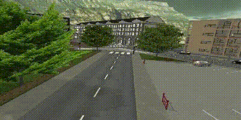
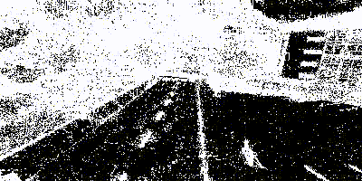
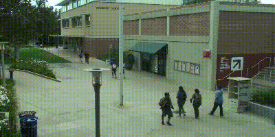
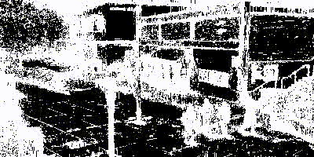

<div id="top"></div>

[![Contributors][contributors-shield]][contributors-url]
<!-- [![Forks][forks-shield]][forks-url]
[![Stargazers][stars-shield]][stars-url]
[![Issues][issues-shield]][issues-url]
[![MIT License][license-shield]][license-url] -->
[![LinkedIn][linkedin-shield]][linkedin-url]


<!-- PROJECT LOGO -->
<br />
<div align="center">
  <a href="https://github.com/github_username/repo_name">
    
  </a>

<h3 align="center">Cuda implementation of Local SVD Binary Pattern for real timeBackground Subtraction</h3>

  <p align="center">
    This project implements some texture and color descriptors for real time background subtraction using cuda and opencv.
    <br />
  </p>
</div>


<!-- ABOUT THE PROJECT -->
## About The Project

<!-- [![Product Name Screen Shot][product-screenshot]](https://example.com) -->


This projects aims to create a surveillance system that can be used to detect moving objects in a video stream.

We implemented two color descriptors: rgb and ycbcr and gray scale and three local binary pattern descriptors: lsbp, olbp and xcslbp.

For further details check our report Parallel_implementation_of_Local_SVD_Binary_Pattern_for_real_time_Background_Subtraction_using_CUDA.pdf

<p align="right">(<a href="#top">back to top</a>)</p>


### Built With

* [Cuda](https://developer.nvidia.com/cuda-toolkit)
* [Opencv](https://opencv.org/)

<p align="right">(<a href="#top">back to top</a>)</p>


<!-- GETTING STARTED -->
## Getting Started

This is an example of how you may give instructions on setting up your project locally.

### Prerequisites

You need opencv4 installed with cuda support.

### Installation

1. Install the prerequesites
2. Clone the repo
   ```sh
   git clone https://github.com/texsmv/lsbp_background_subtraction
   ```
3. Compile the project
   ```sh
   make
   ```

<p align="right">(<a href="#top">back to top</a>)</p>


<!-- USAGE EXAMPLES -->
## Usage

You can change some configurations on the `config.cfg` file.

1. Place a video in data/video_input, like `video1.mp4`.
2. Run the executable exe: with parameters: (height, width, inputName, outputName, 1, 0)
   ```sh
   ./exe 200 400 video1.mp4 video1_out 1 0
   ```
3. Check the output in data/video output.
<p align="right">(<a href="#top">back to top</a>)</p>


## Some results

<!-- [![Product Name Screen Shot][product-screenshot]](https://example.com) -->
<p> Synthetic video: </p>




<p> Real video: </p>




<!-- CONTACT -->
## Contact

Alexis Mendoza - amendozavil@unsa.edu.pe - alexis@paulonia.dev

Project Link: [https://github.com/texsmv/lsbp_background_subtraction](https://github.com/texsmv/lsbp_background_subtraction)

<p align="right">(<a href="#top">back to top</a>)</p>


<!-- MARKDOWN LINKS & IMAGES -->
<!-- https://www.markdownguide.org/basic-syntax/#reference-style-links -->
[contributors-shield]: https://img.shields.io/github/contributors/github_username/repo_name.svg?style=for-the-badge
[contributors-url]: https://github.com/texsmv/lsbp_background_subtraction/graphs/contributors
[forks-shield]: https://img.shields.io/github/forks/github_username/repo_name.svg?style=for-the-badge
[forks-url]: https://github.com/github_username/repo_name/network/members
[stars-shield]: https://img.shields.io/github/stars/github_username/repo_name.svg?style=for-the-badge
[stars-url]: https://github.com/github_username/repo_name/stargazers
[issues-shield]: https://img.shields.io/github/issues/github_username/repo_name.svg?style=for-the-badge
[issues-url]: https://github.com/github_username/repo_name/issues
[license-shield]: https://img.shields.io/github/license/github_username/repo_name.svg?style=for-the-badge
[license-url]: https://github.com/github_username/repo_name/blob/master/LICENSE.txt
[linkedin-shield]: https://img.shields.io/badge/-LinkedIn-black.svg?style=for-the-badge&logo=linkedin&colorB=555
[linkedin-url]: https://www.linkedin.com/in/alexismv/
[product-screenshot]: images/screenshot.png

